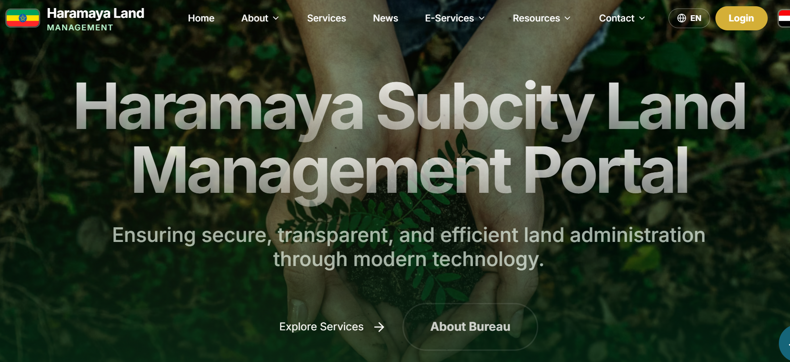
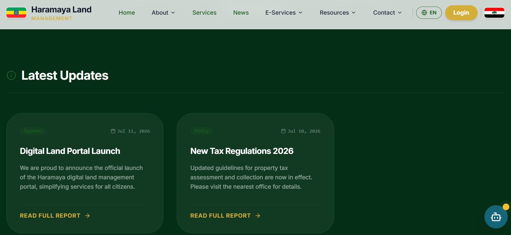

# Haramaya Land Management System (HLMS)

🌐 **Live Site:** [https://haramayalandmanagement.netlify.app/](https://haramayalandmanagement.netlify.app/)

---

## 📸 Screenshots

<div align="center">
  
  <p><em>Interactive dashboard with GIS mapping and bilingual support</em></p>
  
  
  <p><em>Comprehensive land registration and property tax management</em></p>
</div>

---

## 📋 Description

A comprehensive digital platform designed for **Haramaya Wereda and Sub-city** administrations in Ethiopia. The Haramaya Land Management System streamlines property tax assessment, land registration, GIS visualization, and citizen self-service with modern technology and bilingual support.

### ✨ Core Features

- **🗺️ Digital Land Registration** - Efficiently register and document land parcels with digital certificates
- **💰 Property Tax Management** - Transparent assessment and payment history center for citizens
- **👤 Citizen Portal** - Personal dashboard for managing assets, disputes, and accessing services
- **📍 GIS Integration** - High-precision spatial mapping for boundary management and visualization
- **🌐 Bilingual Support** - Fully localized in English and Afan Oromo for accessibility
- **📊 Administrative Dashboard** - Modular tools for GIS updates, valuations, and revenue reporting
- **🔒 Secure Authentication** - Role-based access control for citizens, officials, and administrators
- **📱 Responsive Design** - Optimized for desktop, tablet, and mobile devices

---

## 🚀 Technology Stack

- **Frontend Framework:** [React 19](https://react.dev/) with [TypeScript](https://www.typescriptlang.org/)
- **Build Tool:** [Vite](https://vitejs.dev/) for fast development and optimized production builds
- **Styling:** [Tailwind CSS v4](https://tailwindcss.com/) with custom design system
- **UI Components:** [shadcn/ui](https://ui.shadcn.com/) for accessible, customizable components
- **Animations:** [Framer Motion](https://www.framer.com/motion/) for smooth interactions
- **Backend & Database:** [Supabase](https://supabase.com/) (PostgreSQL, Authentication, Storage)
- **Data Visualization:** [Recharts](https://recharts.org/) for analytics and reports
- **Icons:** [Lucide Icons](https://lucide.dev/) for consistent iconography
- **Deployment:** [Netlify](https://www.netlify.com/) with continuous deployment

---

## 🛠️ Getting Started

### Prerequisites

- **Node.js** v18 or higher
- **npm** or **bun** package manager
- **Git** for version control
- **Supabase** account for backend services

### Installation

1. **Clone the repository:**
   ```bash
   git clone https://github.com/mesudhassen5450-sketch/haramaya_land_management_AI-Map.git
   cd haramaya_land_management_AI-Map
   ```

2. **Install dependencies:**
   ```bash
   npm install
   ```

3. **Configure Environment Variables:**
   
   Create a `.env` file in the root directory:
   ```env
   VITE_SUPABASE_URL=your_supabase_project_url
   VITE_SUPABASE_PUBLISHABLE_KEY=your_supabase_anon_key
   ```

4. **Start Development Server:**
   ```bash
   npm run dev
   ```

5. **Open your browser:**
   
   Navigate to [http://localhost:5173](http://localhost:5173)

---

## 🚢 Deployment

### Deploy on Netlify

**Current Live Site:** [https://haramayalandmanagement.netlify.app/](https://haramayalandmanagement.netlify.app/)

#### Step-by-Step Guide:

1. **Push to GitHub**
   ```bash
   git add .
   git commit -m "Ready for deployment"
   git push origin main
   ```

2. **Import to Netlify**
   - Log in to [Netlify](https://www.netlify.com)
   - Click **Add new site** → **Import an existing project**
   - Connect your GitHub account and select the repository

3. **Configure Build Settings**
   - **Base directory:** `02` (if applicable) or leave empty
   - **Build command:** `npm run build`
   - **Publish directory:** `dist`

4. **Add Environment Variables**
   
   In Netlify dashboard: **Site settings** → **Environment variables**
   - `VITE_SUPABASE_URL`: Your Supabase Project URL
   - `VITE_SUPABASE_PUBLISHABLE_KEY`: Your Supabase Anonymous/Publishable Key

5. **Deploy**
   
   Click **Deploy site** and wait for the build to complete!

> **Note:** The `netlify.toml` file ensures client-side routing works correctly for the Single Page Application.

---

### Deploy on Vercel (Alternative)

1. **Import Project**
   - Log in to [Vercel](https://vercel.com)
   - Click **New Project** and import your GitHub repository

2. **Configure Project**
   - **Framework Preset:** Vite (auto-detected)
   - **Build Command:** `npm run build`
   - **Output Directory:** `dist`

3. **Add Environment Variables**
   - `VITE_SUPABASE_URL`
   - `VITE_SUPABASE_PUBLISHABLE_KEY`

4. **Deploy**
   
   Click **Deploy** for instant deployment!

> **Note:** The `vercel.json` file in the root ensures proper routing for React Router.

---

## 📁 Project Structure

```
haramaya_land_management_AI-Map/
├── public/                 # Static assets
├── src/
│   ├── components/        # Reusable UI components
│   ├── pages/            # Application pages/routes
│   ├── lib/              # Utilities and helpers
│   ├── hooks/            # Custom React hooks
│   ├── types/            # TypeScript type definitions
│   └── styles/           # Global styles and Tailwind config
├── supabase/             # Supabase configuration and migrations
├── .env                  # Environment variables (not committed)
├── netlify.toml          # Netlify deployment configuration
├── vercel.json           # Vercel deployment configuration
├── package.json          # Dependencies and scripts
└── vite.config.ts        # Vite configuration

```

---

## 👨‍💼 Administrative Features

HLMS includes a comprehensive administrative dashboard for government officials:

- **🗺️ GIS Spatial Updates** - Real-time updates to land boundaries and geographical data
- **💵 Property Valuation Adjustments** - Tools for updating property assessments and tax rates
- **⚖️ Dispute Mediation** - Case management system for land ownership disputes
- **📊 Revenue Reporting** - Analytics and reports for tax collection and financial tracking
- **👥 User Management** - Role-based access control for different administrative levels
- **📝 Certificate Generation** - Automated digital land certificate creation
- **🔔 Notification System** - Alerts for citizens regarding payments, disputes, and updates

---

## 🌍 Bilingual Support

The system is fully localized to serve the diverse Haramaya community:

- **English** - Default language for administrative use
- **Afan Oromo** - Native language support for better accessibility

Language preference is stored and persists across sessions.

---

## 🔒 Security & Authentication

- **Supabase Authentication** - Secure user registration and login
- **Role-Based Access Control (RBAC)** - Different permissions for citizens, officials, and administrators
- **Data Encryption** - All sensitive data encrypted at rest and in transit
- **Audit Logging** - Complete activity logs for compliance and security

---

## 🔗 Links

- **Live Application:** [https://haramayalandmanagement.netlify.app/](https://haramayalandmanagement.netlify.app/)
- **GitHub Repository:** [https://github.com/mesudhassen5450-sketch/haramaya_land_management_AI-Map](https://github.com/mesudhassen5450-sketch/haramaya_land_management_AI-Map)

---

## 📞 Support & Contact

For technical support or inquiries about the Haramaya Land Management System, please contact:

**Haramaya Wereda Administration**  
Land Management Department

---

## 🙏 Acknowledgments

- Built with modern web technologies for optimal performance
- UI components from [shadcn/ui](https://ui.shadcn.com/)
- Backend infrastructure by [Supabase](https://supabase.com/)
- Hosted on [Netlify](https://www.netlify.com/)
- Maps and GIS integration for precise land management

---

## 📄 License

All rights reserved. **Haramaya Wereda Administration**.

This system is proprietary software developed for Haramaya Wereda and Sub-city administrations.

---

**Last Updated:** July 2026
